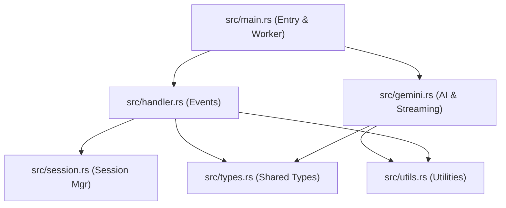
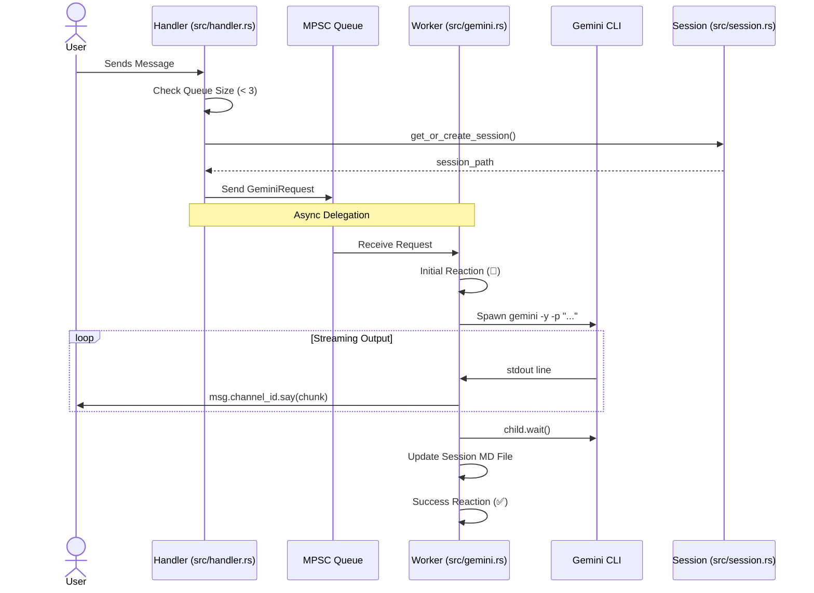

# System Architecture Documentation

This document describes the design and function call structure of the Gemini Discord Bot.

## 🧱 Module Structure

The project is organized into modular components, each with a single responsibility. This design ensures thread safety, maintainability, and clear separation of concerns.

## 🔄 Message Processing Flow

The following sequence diagram illustrates how a user message is processed, from receipt to real-time streaming response.

## 🛠 Component Roles

| Module | Description | Key Functions |
| :--- | :--- | :--- |
| **main.rs** | Entry point, worker initialization, and bot client setup. | `main()` |
| **handler.rs** | Implements Serenity's `EventHandler`. Manages command parsing (`help`, `new`, `list`, `resume`, `summary`) and queuing. | `message()`, `ready()` |
| **gemini.rs** | Handles interaction with the Gemini CLI, including async streaming and summaries. | `process_gemini_request()` |
| **session.rs** | Manages persistent conversation history in Markdown files. | `get_or_create_session()` |
| **utils.rs** | Shared helper functions for logging and message chunking. | `log_to_file()`, `split_message()` |
| **types.rs** | Central location for cross-module data structures. | `struct GeminiRequest` |

## 📁 Data Flow & Persistence

1. **Input**: User message received by `Handler`.
2. **Context**: `Handler` reads the corresponding MD file from `/sessions`.
3. **Prompt**: `GeminiRequest` is built and queued.
4. **Execution**: `Worker` reads `stdout` from the CLI and streams it to Discord.
5. **Persistence**: Final response is appended back to the session MD file.
6. **Logging**: Full prompts are logged to `bot.log`, while console shows summaries.
