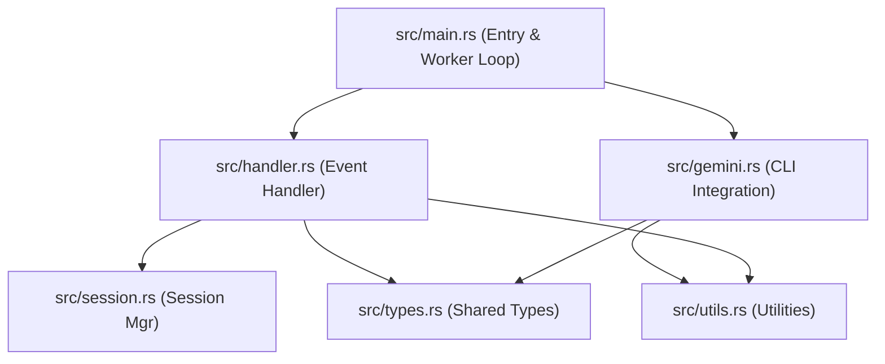
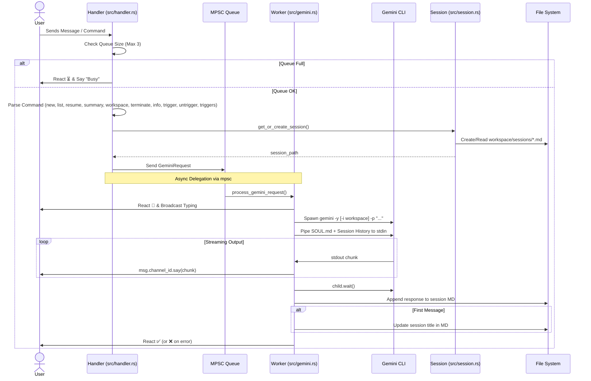

# System Architecture Documentation

This document describes the design and function call structure of the Gemini Discord Bot.

## 🧱 Module Structure

The project is organized into modular components, each with a single responsibility. This design ensures thread safety, maintainability, and clear separation of concerns.



## 🔄 Message Processing Flow

The following sequence diagram illustrates how a user message is processed, from receipt to real-time streaming response.



## 🛠 Component Roles

| Module | Description | Key Functions |
| :--- | :--- | :--- |
| **main.rs** | Entry point. Initializes the bot, mpsc channel, and a background scheduler loop that checks for pending tasks every 30 seconds. Loads `state.json` to restore previous sessions and schedules. | `main()` |
| **handler.rs** | Implements Serenity's `EventHandler`. Manages command parsing (`new`, `list`, `resume`, `summary`, `workspace`, `terminate`, `info`, `trigger`, `untrigger`, `triggers`), request queuing, and state persistence to `state.json`. | `message()`, `ready()`, `save_state()` |
| **gemini.rs** | Orchestrates the Gemini CLI. Handles stdin piping (SOUL.md + History), output streaming, session updates, and autonomous trigger detection with optional scheduling. | `process_gemini_request()` |
| **session.rs** | Manages persistent conversation history. Handles session creation and retrieval from per-channel directories in `workspace/sessions/{channel_id}/`. | `get_or_create_session()` |
| **utils.rs** | Shared helper functions for logging and intelligent message splitting for Discord's limits. | `log_to_file()`, `split_message()` |
| **types.rs** | Defines the `GeminiRequest` and `BotState` structs used for communication and state management. | `struct GeminiRequest`, `struct BotState` |

## 🚀 Trigger Event System

The Trigger Event System allows the bot to execute predefined tasks based on specific identifiers. These tasks are stored in `workspace/tasks.json` and consist of a unique ID and a corresponding prompt.

### ⚙️ Mechanism

1.  **Registry (`tasks.json`)**: A JSON file containing a list of tasks.
    ```json
    {
      "tasks": [
        { "id": "daily_report", "prompt": "Summarize today's activities.", "interval": 86400 }
      ]
    }
    ```
    Tasks can optionally include an `interval` in seconds.
2.  **Manual Trigger**: Users can invoke a task using the `!trigger <id>` command. 
    - If the task has an `interval`, it is added to the **Scheduled Tasks** list and will run periodically.
    - The task is also executed **immediately** upon being triggered.
3.  **Autonomous Trigger**: The AI can trigger its own next steps by including `[[trigger:<id>]]` in its response. The `gemini.rs` module uses regex to scan for this pattern and automatically re-queues the associated task.
4.  **System-Initiated Requests**: `GeminiRequest` has been decoupled from requiring a direct user `Message` object, allowing the system or the AI to initiate requests using only a `ChannelId`.

## 🕒 Background Scheduler

The bot runs a background loop (in `main.rs`) that checks every 30 seconds for scheduled tasks that are due to run. 
- It compares the `last_run` time with the current time and the task's `interval`.
- When a task is due, it creates a `GeminiRequest` and sends it to the worker queue.
- Scheduled tasks are persisted in the bot's state, allowing them to resume after a restart.

## 📁 Data Flow & Persistence

1.  **Input**: User messages or commands are received by the `Handler`.
2.  **Context Injection**:
    *   **SOUL.md**: If `workspace/SOUL.md` exists, it is piped to the CLI's `stdin` as the first context block.
    *   **Session History**: The content of the current session's Markdown file (`workspace/sessions/{channel_id}/{session_name}.md`) is piped to `stdin` after the SOUL.
    *   **Workspace**: If a workspace path is set via the `workspace` command, it is passed to the CLI via the `--include-directories` flag.
3.  **Execution**: The CLI is invoked with a system prompt and the latest message. Output is captured from `stdout` (for content) and `stderr` (for errors/debugging).
4.  **Streaming**: Responses are buffered and sent to Discord in chunks (max 2000 chars) to ensure real-time feedback.
5.  **Persistence**:
    *   **Sessions**: Saved in `workspace/sessions/{channel_id}/{timestamp}.md`. This ensures that each channel maintains its own independent conversation history.
    *   **State**: The bot's global state (active session and current workspace for each channel) is saved to `workspace/sessions/state.json` whenever it changes. This allows the bot to resume seamlessly after a restart.
    *   **Logging**: Full CLI invocations are logged to `bot.log`.
    *   **Title**: The first message of a session triggers an update of the H1 header in the session file to serve as a title.

## 🛠 Libraries & Dependencies

- **Serenity**: Discord API interaction.
- **Tokio**: Asynchronous runtime and I/O.
- **Chrono**: Timestamp generation for session files.
- **Serde / Serde_JSON**: Serialization and deserialization of the bot's state for persistence.
- **Dotenvy**: Environment variable management.

## 🚦 Status Indicators (Reactions)

*   👀: Processing/Thinking.
*   ⏳: Queue is full (3/3).
*   ✅: Successfully responded and saved.
*   ❌: Error encountered during execution.
